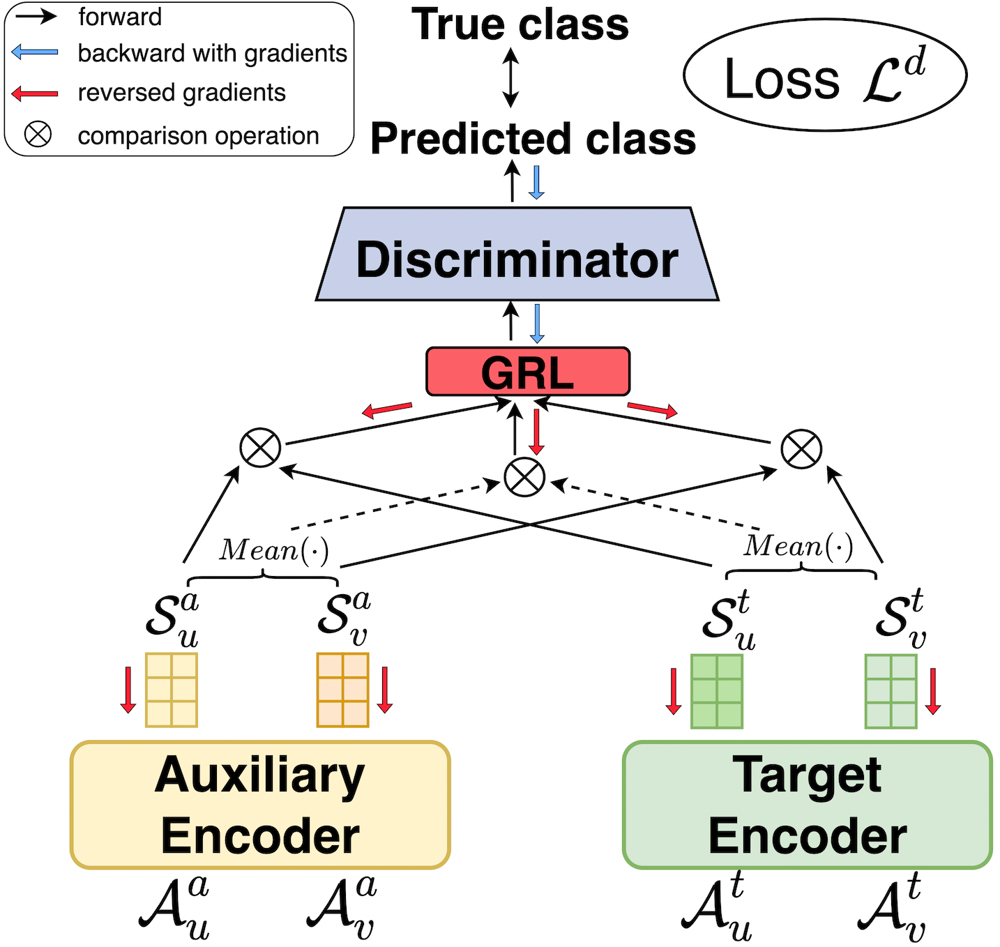

# AdaRex (From Original README)
This is the repository containing the code for the SIGIR-AP 2023 paper "AdaReX: Cross-Domain, Adaptive and Explainable Recommender System". 

We propose AdaReX (Adaptive eXplainable Recommendation), to model auxiliary and target domains simultaneously. By performing specific tasks in respective domains and their interconnection via a discriminator model, AdaReX allows the aspect sequences to learn common knowledge across different domains.

# Cuda Setup
* Run: _git clone https://github.com/pm-coding/AdaRex-adjusted.git_

* Setup a conda environment with: _python 3.9.0_

* Install pip with: _conda install pip_

* Run the requirments.txt:  _pip install -r requirements.txt_

* Run: _jupyter lab_

* Go to Run-> Restart Kernel and Run All Cells

# Non-Cuda Setup
* Run: _git clone https://github.com/pm-coding/AdaRex-adjusted.git_
* Remove from the requirements.txt:
    * pywin32==306
    * torch==2.2.1+cu118
    * torchaudio==2.2.1+cu118
    * torchdata==0.7.1
    * torchtext
    * torchvision==0.17.1+cu118
* From train_classifier.ipynb
    * Remove: _torch.cuda.current_device()_
    * Remove: _accelerator="cuda:0"_
    * Replace: _model.validIter(test_dataloader, "cuda:0", ["loss", "precision"], False)_ with _model.validIter(test_dataloader, "cpu", ["loss", "precision"], False)_

* Run: _conda install pytorch torchvision torchaudio cpuonly -c pytorch_
* Run: _pip install torchtext_
* _jupyter lab_
* Go to Run-> Restart Kernel and Run All Cells

# Create a conda env on ICL-6 machines
* _mkdir -p ~/miniconda3_
* _wget https://repo.anaconda.com/miniconda/Miniconda3-latest-Linux-x86_64.sh -O ~/miniconda3/miniconda.sh_
* _bash ~/miniconda3/miniconda.sh -b -u -p ~/miniconda3_
* _rm -rf ~/miniconda3/miniconda.sh_
* _~/miniconda3/bin/conda init bash_
* _~/miniconda3/bin/conda init zsh_
* _conda create --name myenv python=3.9_
* _conda activate myenv_

