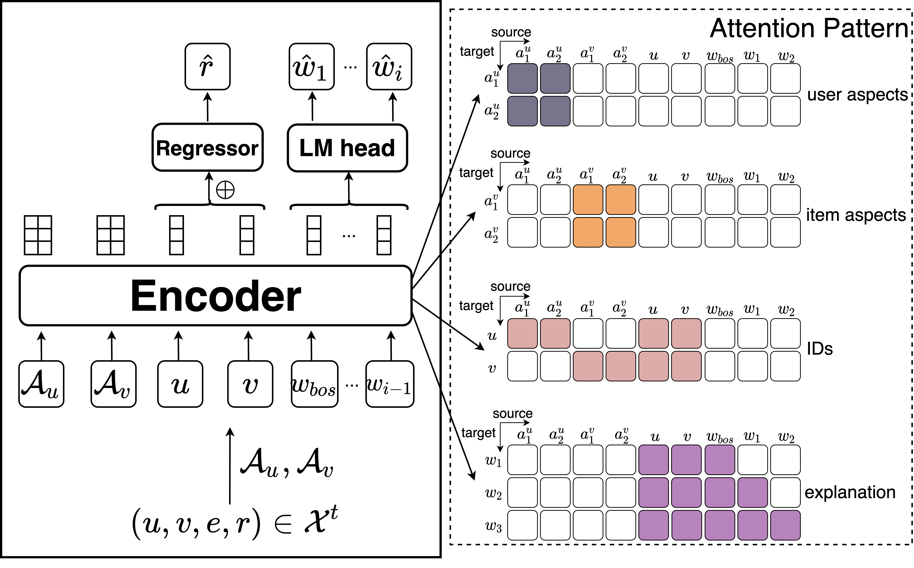
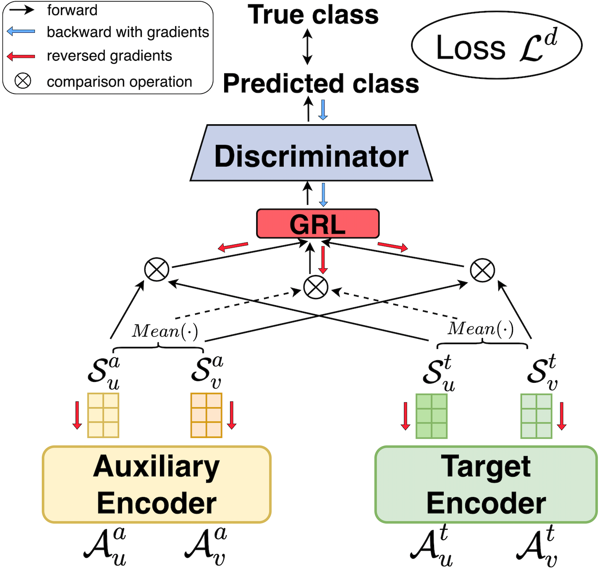

# AdaRex
This is the repository containing the code for the SIGIR-AP 2023 paper "AdaReX: Cross-Domain, Adaptive and Explainable Recommender System". 

We propose AdaReX (Adaptive eXplainable Recommendation), to model auxiliary and target domains simultaneously. By performing specific tasks in respective domains and their interconnection via a discriminator model, AdaReX allows the aspect sequences to learn common knowledge across different domains.

# Setup
Setup a conda environment with python 3.9.0

Install pip with conda install pip

Run the requirments.txt.  pip install -r requirements.txt

If possible, install the latest version of PyTorch with Cuda.  conda install pytorch torchvision torchaudio pytorch-cuda=11.8 -c pytorch -c nvidia

Run jupyter lab

For Non-Cuda Setup:
delete all torch requirements from requirments.txt

Run conda install pytorch torchvision torchaudio cpuonly -c pytorch

Run pip install torchtext

